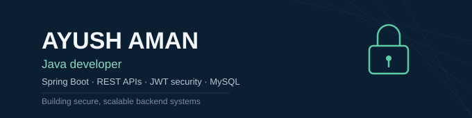

## 👨‍💻 About me

> Aspiring backend engineer focused on **Java and Spring Boot**, building secure REST APIs and full-stack applications with JWT authentication, relational data modeling, and cloud deployment. Comfortable working independently and in Agile teams, with a growing foundation in Data Structures & Algorithms.

- 🔭 **Currently building:** full-stack Java/Spring Boot applications with secure auth and real deployments
- 🌱 **Currently learning:** advanced Data Structures & Algorithms, Elasticsearch-based search
- 🎓 **Background:** B.Tech, Electronics and Communication (2022–2026), Gurukul Kangri Vishwavidyalaya — CGPA 8.64
- 🤝 **Looking to collaborate on:** Java/Spring Boot backend projects
- 📍 **Reach me:** [LinkedIn](https://www.linkedin.com/in/ayush-aman-4a3378273) · ayush.aman809@gmail.com
- ⚡ **Fun fact:** started in Electronics & Communication, ended up shipping backend systems

---

## 💼 Experience

**Java Developer Intern** · Saiket System · `Mar 2025 – Apr 2025` · Remote
Built a Text-File Analyzer computing word frequency and keyword search using core data structures and file I/O, and a To-Do List app with full CRUD functionality using OOP design.
`Java` `OOP` `Data Structures` `File I/O`

**Java Developer Intern** · Oasis Info Byte · `Sep 2024 – Oct 2024` · Remote
Built an ATM interface supporting deposit, withdrawal, transfer, and transaction history, and extended a Number Guessing Game with multi-round, multi-set scoring logic.
`Java` `OOP` `Control Flow`

---

## 🚀 Featured projects

**Expense Tracker with Analytics Dashboard**
Full-stack expense tracker with JWT-based authentication and role-based access control, Chart.js dashboards over RESTful endpoints, PDF/Excel export, deployed on AWS.
`Java` `Spring Boot` `MySQL` `JWT` `REST API`
🔗 *add your repo link here*

**Job Portal with Resume Matching**
Job portal with role-specific dashboards for candidates, employers, and admins. Elasticsearch-based resume keyword matching recommends relevant listings. End-to-end JWT security.
`Java` `Spring Boot` `MySQL` `JWT` `Elasticsearch`
🔗 *add your repo link here*

---

## 🛠️ Tech stack

**Languages**

**Backend**

**Data & tools**

**Front end**

---

## 📊 GitHub stats

---

⭐️ If any of this is useful, a follow or star is always appreciated.

